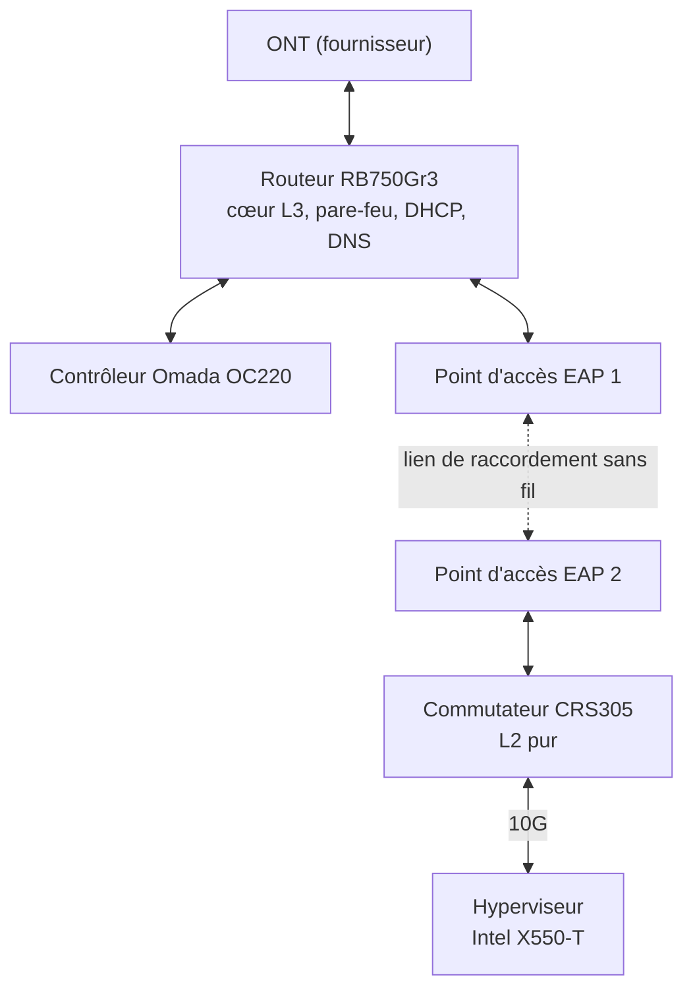
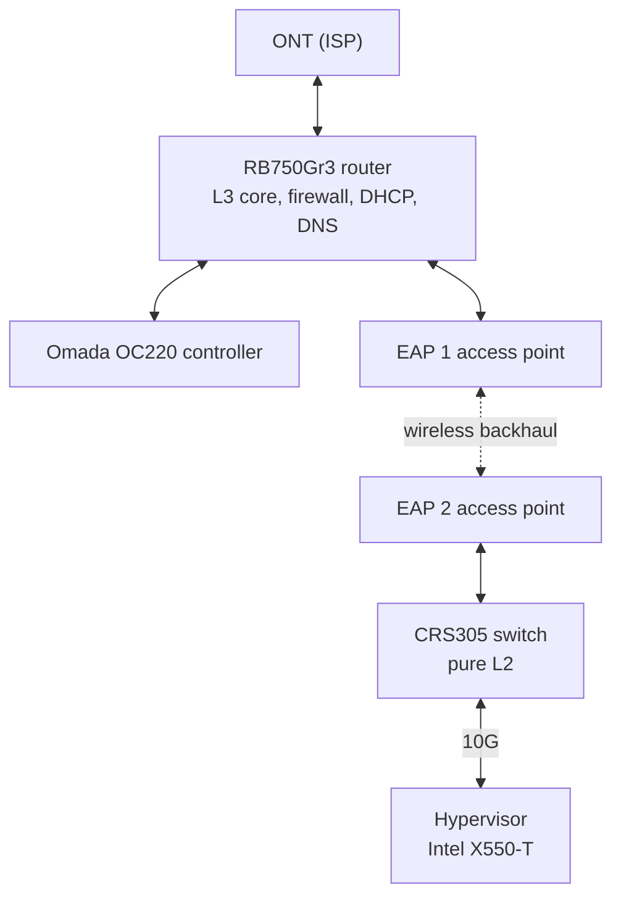

> **[Francais](#francais)** | **[English](#english)**

## Français

> **Projet personnel** (laboratoire maison)

# Réseau domestique segmenté en VLAN (MikroTik, Omada)

Réseau domestique segmenté en 24 VLAN, conçu pour remplacer un routeur grand public et isoler les réseaux destinés à un hyperviseur, le tout derrière un seul pare-feu. Un routeur MikroTik RB750Gr3 sert de cœur L3 et de pare-feu, un commutateur MikroTik CRS305 forme une couche L2 pure, et deux points d'accès TP-Link Omada transportent les VLAN étiquetés par un lien de raccordement sans fil maillé jusqu'au commutateur et à l'hyperviseur. Chaque VLAN est en double pile IPv4/IPv6 et la politique de sécurité repose sur des zones avec refus par défaut.

> **État :** réseau démantelé depuis (le commutateur sert maintenant de commutateur L2 sur un autre site et le routeur est inutilisé). Les fichiers de ce dossier sont les exports finaux des deux appareils MikroTik, ce qui permet de reconstruire le réseau.

---

## Topologie

### Ports

| Appareil | Port | Rôle |
|---|---|---|
| RB750Gr3 | ether1 | WAN vers l'ONT |
| RB750Gr3 | ether2 | Trunk principal vers l'EAP 1 : les 24 VLAN étiquetés, VLAN natif 777 |
| RB750Gr3 | ether3 | Port d'accès du contrôleur Omada : VLAN de gestion 254 non étiqueté |
| RB750Gr3 | ether4 | Trunk de points d'accès : VLAN Wi-Fi et gestion étiquetés, VLAN natif 777 |
| RB750Gr3 | ether5 | Trunk de points d'accès : VLAN Wi-Fi étiquetés, gestion non étiquetée (adoption des points d'accès) |
| CRS305 | ether1 | Trunk vers l'EAP 2 (1G) |
| CRS305 | sfp-sfpplus1 | Trunk vers la carte réseau 10G de l'hyperviseur |
| CRS305 | sfp-sfpplus2 à 4 | Désactivés, placés dans le VLAN mort 666 |

---

## Plan d'adressage

Le troisième octet IPv4 et l'identifiant de sous-réseau IPv6 correspondent au numéro de VLAN. Chaque VLAN a sa passerelle (`.1` / `::1`) sur une interface VLAN du routeur. En IPv6, chaque VLAN reçoit un /64 tiré d'un préfixe ULA `fd5d:c575:3bea::/48`.

| VLAN | Nom | IPv4 | Adressage | Zone |
|---|---|---|---|---|
| 1000 | Hyperviseurs | 192.168.0.0/24 | Statique | hypervisor |
| 10 | Privé (Wi-Fi) | 192.168.10.0/24 | Statique .2-.49, DHCP .50-.254 | trusted |
| 20 | Stockage | 192.168.20.0/24 | Statique | infra |
| 30 | Bases de données | 192.168.30.0/24 | Statique | infra |
| 40 | Supervision | 192.168.40.0/24 | Statique | infra |
| 50-59 | VM1 à VM10 | 192.168.50.0/24 à 192.168.59.0/24 | Statique .2-.49, DHCP .50-.254 | trusted |
| 60 | Conteneurs | 192.168.60.0/24 | Statique | infra |
| 70 | Applications (production) | 192.168.70.0/24 | Statique .2-.49, DHCP .50-.254 | trusted |
| 80 | Développement (préproduction) | 192.168.80.0/24 | Statique .2-.49, DHCP .50-.254 | trusted |
| 90 | Bac à sable | 192.168.90.0/24 | Statique .2-.49, DHCP .50-.254 | sandbox |
| 100 | DMZ | 192.168.100.0/24 | Statique | dmz |
| 128 | Étage (Wi-Fi) | 192.168.128.0/24 | DHCP .2-.254 | untrusted |
| 129 | Sous-sol (Wi-Fi) | 192.168.129.0/24 | DHCP .2-.254 | untrusted |
| 200 | IoT (Wi-Fi) | 192.168.200.0/24 | Statique .2-.49, DHCP .50-.254 (bail de 4 semaines et 2 jours) | untrusted |
| 254 | Gestion | 192.168.254.0/28 | Statique | mgmt |

Les VLAN Wi-Fi (10, 128, 129, 200) ont chacun leur propre SSID. Gestion : `.1` routeur, `.2` commutateur, `.3` contrôleur Omada, `.4` et `.5` points d'accès, avec des noms DNS statiques en `.mgmt`.

VLAN sans adresse :
- **777** : VLAN natif des trunks, non routé, pour qu'aucune trame non étiquetée ne tombe dans un réseau utile.
- **666** : VLAN mort des ports inutilisés du commutateur (désactivés et limités aux trames non étiquetées).

Les VLAN Wi-Fi ne sont transportés que vers les points d'accès : ils n'atteignent jamais le commutateur de l'hyperviseur, qui ne reçoit que les VLAN serveurs (20 à 100), l'hyperviseur (1000) et la gestion (254).

---

## Services

- **DHCP :** 17 serveurs, un par VLAN de clients ou de VM, avec le routeur comme passerelle et DNS. Les VLAN d'infrastructure, la DMZ, la gestion et l'hyperviseur sont en adressage statique uniquement.
- **DNS :** le routeur sert de résolveur avec cache (amonts Cloudflare et Google, en IPv4 et IPv6), accessible seulement depuis les VLAN servis par DHCP, sauf le bac à sable.
- **IPv6 :** adresses ULA annoncées par SLAAC (paramètres par défaut de RouterOS). Le commutateur n'annonce rien.

---

## Pare-feu

La politique repose sur des listes d'adresses qui définissent des zones. Les mêmes zones existent en IPv6 (suffixe `6`), avec en plus `ula48` pour tout l'espace interne.

| Zone | VLAN |
|---|---|
| trusted | 10, 50-59, 70, 80 |
| infra | 20, 30, 40, 60 |
| hypervisor | 1000 |
| dmz | 100 |
| sandbox | 90 |
| untrusted | 128, 129, 200 |
| mgmt | 254 |

### Entrée (trafic vers le routeur)

| # | Source | Action |
|---|---|---|
| 1 | Toutes | Accepter les connexions établies et liées |
| 2 | Toutes | Rejeter les paquets invalides |
| 3 | mgmt, hypervisor | Accepter (administration du routeur) |
| 4 | trusted, hypervisor | Accepter ICMP |
| 5 | VLAN servis par DHCP, sauf le bac à sable | Accepter DNS (UDP et TCP 53) |
| 6 | Toutes | Refuser |

### Transfert IPv4 (entre VLAN et vers Internet)

| # | Source | Destination | Action |
|---|---|---|---|
| 1 | Toutes | Toutes | FastTrack et acceptation des connexions établies et liées |
| 2 | Toutes | Toutes | Rejeter les paquets invalides |
| 3 | trusted | trusted | Accepter |
| 4 | hypervisor, mgmt | mgmt | Accepter |
| 5 | trusted, hypervisor | dmz | Accepter |
| 6 | hypervisor | infra, trusted | Accepter |
| 7 | infra, Apps (70), Dev (80), VM (50-59) | infra | Accepter |
| 8 | Privé (10), hypervisor, Wi-Fi (128, 129) | IoT (200) | Accepter |
| 9 | IoT (200) | Wi-Fi (128, 129) | Accepter |
| 10 | sandbox | sandbox | Accepter |
| 11 | trusted, hypervisor, untrusted, dmz | WAN | Accepter |
| 12 | dmz | Toutes | Rejeter (la DMZ ne peut pas initier vers l'interne) |
| 13 | sandbox | Toutes | Rejeter (aucune sortie) |
| 14 | Toutes | sandbox | Rejeter |
| 15 | untrusted | RFC 1918 | Rejeter |
| 16 | Toutes | mgmt | Rejeter |
| 17 | Toutes | Toutes | Refuser |

### IPv6

La politique IPv6 reprend la même logique, avec trois différences :
- ICMPv6 est toujours accepté, car la découverte des voisins et la découverte du MTU en dépendent.
- Chaque règle d'accès à Internet est précédée d'un rejet vers `ula48`, pour qu'elle ne s'applique qu'au trafic qui quitte l'espace interne.
- Pas de FastTrack ni de NAT.

---

## Problèmes connus

Ces points sont visibles dans les exports et seraient corrigés lors d'une reconstruction :

1. **ether1 est encore membre du pont.** Comme le port WAN est un port esclave du pont, RouterOS signale les règles NAT comme invalides et le client DHCP WAN comme inactif. Correction : retirer ether1 du pont et faire correspondre le NAT sur la liste d'interfaces `WAN`.
2. **Règle NAT en double.** La règle de masquage apparaît deux fois.
3. **Client DHCP par défaut sur le pont.** Reste de la configuration d'origine, à supprimer une fois ether1 sorti du pont.
4. **IPv6 interne seulement.** Le préfixe délégué par le fournisseur est demandé, mais il n'est attribué à aucun VLAN : seules les adresses ULA sont utilisées.
5. **Liste d'adresses `mgmt` en /24** alors que le sous-réseau de gestion est un /28 (sans conséquence, mais à aligner).
6. **Pas de route par défaut sur le commutateur.** Son adresse de gestion ne répond qu'à l'intérieur du /28 de gestion, même si le pare-feu autorise l'hyperviseur à joindre la gestion. Correction : ajouter une route par défaut vers 192.168.254.1.

---

## Fichiers

| Fichier | Contenu |
|---|---|
| `RB750Gr3-backhaul.rsc` | Export RouterOS 7 du routeur (VLAN, DHCP, DNS, pare-feu IPv4 et IPv6, NAT) |
| `CRS305-backhaul.rsc` | Export RouterOS 7 du commutateur (pont VLAN, trunks, gestion) |

---

## Tech stack

MikroTik RouterOS 7 (RB750Gr3, CRS305-1G-4S+), TP-Link Omada (points d'accès EAP, contrôleur OC220), VLAN 802.1Q, double pile IPv4/IPv6 (ULA), pare-feu à états par zones, DHCP, DNS, SFP+ 10G

---

## English

> **Personal project** (homelab)

# Segmented Inter-VLAN Home Network (MikroTik, Omada)

A home network segmented into 24 VLANs, built to replace a consumer router and isolate the networks feeding a hypervisor, all behind a single firewall. A MikroTik RB750Gr3 router is the L3 core and firewall, a MikroTik CRS305 switch is a pure L2 layer, and two TP-Link Omada access points carry the tagged VLANs over a wireless mesh backhaul to the switch and the hypervisor. Every VLAN is dual-stack IPv4/IPv6, and the security policy is built on zones with a default deny.

> **Status:** the network has since been dismantled (the switch now serves as an L2 switch at another site and the router is unused). The files in this folder are the final exports of both MikroTik devices, so the network can be rebuilt.

---

## Topology

### Ports

| Device | Port | Role |
|---|---|---|
| RB750Gr3 | ether1 | WAN to the ONT |
| RB750Gr3 | ether2 | Main trunk to EAP 1: all 24 VLANs tagged, native VLAN 777 |
| RB750Gr3 | ether3 | Omada controller access port: management VLAN 254 untagged |
| RB750Gr3 | ether4 | Access point trunk: Wi-Fi VLANs and management tagged, native VLAN 777 |
| RB750Gr3 | ether5 | Access point trunk: Wi-Fi VLANs tagged, management untagged (access point adoption) |
| CRS305 | ether1 | Trunk to EAP 2 (1G) |
| CRS305 | sfp-sfpplus1 | Trunk to the hypervisor's 10G NIC |
| CRS305 | sfp-sfpplus2 to 4 | Disabled, parked in dead VLAN 666 |

---

## Addressing plan

The third IPv4 octet and the IPv6 subnet ID match the VLAN number. Each VLAN has its gateway (`.1` / `::1`) on a VLAN interface of the router. For IPv6, each VLAN gets a /64 from the ULA prefix `fd5d:c575:3bea::/48`.

| VLAN | Name | IPv4 | Addressing | Zone |
|---|---|---|---|---|
| 1000 | Hypervisors | 192.168.0.0/24 | Static | hypervisor |
| 10 | Private (Wi-Fi) | 192.168.10.0/24 | Static .2-.49, DHCP .50-.254 | trusted |
| 20 | Storage | 192.168.20.0/24 | Static | infra |
| 30 | Databases | 192.168.30.0/24 | Static | infra |
| 40 | Monitoring | 192.168.40.0/24 | Static | infra |
| 50-59 | VM1 to VM10 | 192.168.50.0/24 to 192.168.59.0/24 | Static .2-.49, DHCP .50-.254 | trusted |
| 60 | Containers | 192.168.60.0/24 | Static | infra |
| 70 | Apps (production) | 192.168.70.0/24 | Static .2-.49, DHCP .50-.254 | trusted |
| 80 | Dev (pre-production) | 192.168.80.0/24 | Static .2-.49, DHCP .50-.254 | trusted |
| 90 | Sandbox | 192.168.90.0/24 | Static .2-.49, DHCP .50-.254 | sandbox |
| 100 | DMZ | 192.168.100.0/24 | Static | dmz |
| 128 | Upstairs (Wi-Fi) | 192.168.128.0/24 | DHCP .2-.254 | untrusted |
| 129 | Basement (Wi-Fi) | 192.168.129.0/24 | DHCP .2-.254 | untrusted |
| 200 | IoT (Wi-Fi) | 192.168.200.0/24 | Static .2-.49, DHCP .50-.254 (4-week, 2-day leases) | untrusted |
| 254 | Management | 192.168.254.0/28 | Static | mgmt |

The Wi-Fi VLANs (10, 128, 129, 200) each have their own SSID. Management: `.1` router, `.2` switch, `.3` Omada controller, `.4` and `.5` access points, with static `.mgmt` DNS names.

VLANs without an address:
- **777**: native VLAN of the trunks, not routed, so untagged frames never land in a real network.
- **666**: dead VLAN for the switch's unused ports (disabled and limited to untagged frames).

The Wi-Fi VLANs only go to the access points: they never reach the hypervisor switch, which only carries the server VLANs (20 to 100), the hypervisors (1000) and management (254).

---

## Services

- **DHCP:** 17 servers, one per client or VM VLAN, with the router as gateway and DNS. The infrastructure VLANs, the DMZ, management and the hypervisors are static only.
- **DNS:** the router is a caching resolver (Cloudflare and Google upstreams over IPv4 and IPv6), reachable only from the VLANs served by DHCP, except the sandbox.
- **IPv6:** ULA addresses advertised with SLAAC (RouterOS defaults). The switch advertises nothing.

---

## Firewall

The policy is built on address lists that define zones. The same zones exist for IPv6 (suffix `6`), plus `ula48` for the whole internal range.

| Zone | VLANs |
|---|---|
| trusted | 10, 50-59, 70, 80 |
| infra | 20, 30, 40, 60 |
| hypervisor | 1000 |
| dmz | 100 |
| sandbox | 90 |
| untrusted | 128, 129, 200 |
| mgmt | 254 |

### Input (traffic to the router)

| # | Source | Action |
|---|---|---|
| 1 | Any | Accept established and related |
| 2 | Any | Drop invalid |
| 3 | mgmt, hypervisor | Accept (router management) |
| 4 | trusted, hypervisor | Accept ICMP |
| 5 | VLANs served by DHCP, except the sandbox | Accept DNS (UDP and TCP 53) |
| 6 | Any | Deny |

### IPv4 forward (between VLANs and to the internet)

| # | Source | Destination | Action |
|---|---|---|---|
| 1 | Any | Any | FastTrack and accept established and related |
| 2 | Any | Any | Drop invalid |
| 3 | trusted | trusted | Accept |
| 4 | hypervisor, mgmt | mgmt | Accept |
| 5 | trusted, hypervisor | dmz | Accept |
| 6 | hypervisor | infra, trusted | Accept |
| 7 | infra, Apps (70), Dev (80), VMs (50-59) | infra | Accept |
| 8 | Private (10), hypervisor, Wi-Fi (128, 129) | IoT (200) | Accept |
| 9 | IoT (200) | Wi-Fi (128, 129) | Accept |
| 10 | sandbox | sandbox | Accept |
| 11 | trusted, hypervisor, untrusted, dmz | WAN | Accept |
| 12 | dmz | Any | Drop (the DMZ cannot initiate toward the inside) |
| 13 | sandbox | Any | Drop (no way out) |
| 14 | Any | sandbox | Drop |
| 15 | untrusted | RFC 1918 | Drop |
| 16 | Any | mgmt | Drop |
| 17 | Any | Any | Deny |

### IPv6

The IPv6 policy follows the same logic, with three differences:
- ICMPv6 is always accepted, because neighbor discovery and path MTU discovery depend on it.
- Each internet access rule is preceded by a drop to `ula48`, so it only matches traffic leaving the internal range.
- No FastTrack and no NAT.

---

## Known issues

These are visible in the exports and would be fixed in a rebuild:

1. **ether1 is still a bridge member.** Because the WAN port is a bridge slave, RouterOS flags the NAT rules as invalid and the WAN DHCP client as inactive. Fix: remove ether1 from the bridge and match the NAT on the `WAN` interface list.
2. **Duplicate NAT rule.** The masquerade rule appears twice.
3. **Default DHCP client on the bridge.** Left over from the default configuration, to be removed once ether1 is out of the bridge.
4. **IPv6 is internal only.** The ISP-delegated prefix is requested but not assigned to any VLAN, so only ULA addresses are used.
5. **`mgmt` address list is a /24** while the management subnet is a /28 (harmless, but should match).
6. **No default route on the switch.** Its management address only answers from inside the management /28, even though the firewall lets the hypervisors reach management. Fix: add a default route via 192.168.254.1.

---

## Files

| File | Contents |
|---|---|
| `RB750Gr3-backhaul.rsc` | RouterOS 7 export of the router (VLANs, DHCP, DNS, IPv4 and IPv6 firewall, NAT) |
| `CRS305-backhaul.rsc` | RouterOS 7 export of the switch (VLAN bridge, trunks, management) |

---

## Tech stack

MikroTik RouterOS 7 (RB750Gr3, CRS305-1G-4S+), TP-Link Omada (EAP access points, OC220 controller), 802.1Q VLANs, dual-stack IPv4/IPv6 (ULA), zone-based stateful firewall, DHCP, DNS, 10G SFP+
